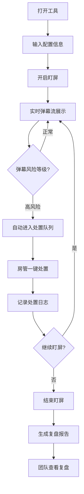

## 1. 产品概述

直播弹幕盯屏工具——面向单场直播房管和助播的桌面端弹幕风控工具，重点解决现场人手少、弹幕滚动快时漏看风险的问题。系统自动按风险标签标色显示弹幕，高风险弹幕自动暂停至处置队列，支持一键操作和全程留痕，直播结束后生成复盘报告，方便团队交接和改进话术。

- 核心用户：直播间房管、助播、运营负责人
- 核心价值：降低弹幕漏看率、提升风控响应速度、形成可追溯的处置闭环

## 2. 核心功能

### 2.1 用户角色

| 角色 | 使用方式 | 核心权限 |
|------|----------|----------|
| 房管 | 输入房间配置后进入盯屏 | 配置敏感词、处置弹幕、查看复盘 |
| 助播 | 辅助盯屏 | 处置弹幕、查看复盘 |
| 运营负责人 | 查看复盘记录 | 仅查看复盘报告 |

### 2.2 功能模块

1. **配置页**：直播间名称、活动类型、品牌禁词、当晚敏感话题输入，一键开启盯屏
2. **实时弹幕窗**：弹幕流实时展示，按风险标签标色，弹幕密度与速度指示器
3. **处置队列**：高风险弹幕自动暂停展示，一键处置操作面板
4. **复盘记录**：风险高峰分钟图、常见风险词云、已处理/未处理统计、处置日志

### 2.3 页面详情

| 页面名称 | 模块名称 | 功能描述 |
|----------|----------|----------|
| 配置页 | 直播间信息 | 输入直播间名称、活动类型 |
| 配置页 | 风险词库 | 输入品牌禁词（逗号分隔）、当晚敏感话题（逗号分隔），预置默认分类标签 |
| 配置页 | 开启盯屏 | 校验必填项后进入实时弹幕窗 |
| 实时弹幕窗 | 弹幕流 | 实时滚动弹幕，按风险等级标色：辱骂(红)、人身攻击(橙)、诱导维权(黄)、涉政擦边(紫)、恶意带节奏(蓝)、正常(白) |
| 实时弹幕窗 | 弹幕统计栏 | 当前弹幕速率(条/分)、高风险占比、已处理/未处理计数 |
| 实时弹幕窗 | 快捷筛选 | 按标签筛选弹幕，支持多选 |
| 实时弹幕窗 | 手动标记 | 点击任意弹幕可手动加入处置队列 |
| 处置队列 | 队列列表 | 高风险弹幕按时间倒序排列，显示风险标签、原文、时间 |
| 处置队列 | 一键处置 | 四个操作按钮：提醒主播绕开、请求禁言、截图留证、暂不处理 |
| 处置队列 | 处置历史 | 已处置弹幕折叠展示，显示处置动作和处理人 |
| 复盘记录 | 风险时间线 | 以分钟为单位的弹幕风险密度折线图，标注风险高峰分钟 |
| 复盘记录 | 常见风险词 | 弹幕高频风险词云展示 |
| 复盘记录 | 处置统计 | 已处理/未处理条数、各处置类型占比饼图 |
| 复盘记录 | 处置日志 | 完整处置记录表格：时间、原文、风险标签、处置动作、处理人 |
| 复盘记录 | 导出报告 | 一键导出复盘报告（JSON 格式） |

## 3. 核心流程

1. 房管打开工具，输入直播间名称、活动类型，配置品牌禁词和敏感话题
2. 点击"开启盯屏"，系统开始模拟接收弹幕流
3. 弹幕在实时弹幕窗中按风险标签标色滚动显示
4. 高风险弹幕自动暂停至处置队列，房管/助播点击一键处置
5. 每次处置操作自动记录时间、原文、处置动作和处理人
6. 直播结束，点击"结束盯屏"生成复盘报告
7. 团队查看复盘记录，分析风险高峰和话术改进点

## 4. 用户界面设计

### 4.1 设计风格

- **主色调**：深色背景（#0F1117），搭配高对比度风险标签色，营造监控中心的沉浸氛围
- **辅色调**：暗灰色面板底色（#1A1D28），边框线（#2A2D3A），营造专业监控台质感
- **按钮风格**：圆角矩形，处置按钮采用实心高饱和色，次要操作用描边按钮
- **字体**：标题使用 Noto Sans SC Bold，正文使用 Noto Sans SC Regular，弹幕等宽展示使用 JetBrains Mono
- **布局风格**：三栏式专业监控台布局，左侧弹幕流、中间处置队列、右侧统计面板
- **图标风格**：线性图标，使用 lucide-react 图标库

### 4.2 页面设计概览

| 页面名称 | 模块名称 | UI 元素 |
|----------|----------|---------|
| 配置页 | 直播间信息 | 深色全屏居中卡片，输入框带图标前缀，品牌禁词和敏感话题使用标签输入组件 |
| 配置页 | 开启盯屏 | 底部全宽主操作按钮，脉冲动画提示 |
| 实时弹幕窗 | 弹幕流 | 左侧 60% 宽度，深色背景滚动列表，风险标签用左侧色条指示，弹幕文本白色 |
| 实时弹幕窗 | 统计栏 | 顶部状态栏，数字用大号加粗，实时跳动动画 |
| 实时弹幕窗 | 筛选器 | 弹幕区顶部标签栏，点击高亮筛选 |
| 处置队列 | 队列列表 | 中间 25% 宽度，卡片式排列，风险标签色角标，脉冲呼吸动画提示待处理 |
| 处置队列 | 一键处置 | 四个横排按钮，颜色分别对应：绿色(提醒)、红色(禁言)、黄色(截图)、灰色(跳过) |
| 复盘记录 | 风险时间线 | 全宽折线图，峰值区域红色高亮 |
| 复盘记录 | 常见风险词 | 词云图，字号按频次递减 |
| 复盘记录 | 处置统计 | 左侧饼图 + 右侧数字统计卡片 |
| 复盘记录 | 处置日志 | 全宽表格，支持按列排序和关键词搜索 |

### 4.3 响应式策略

- 桌面优先设计，最低支持 1280px 宽度
- 三栏布局在 1280px-1920px 之间自适应伸缩
- 小于 1280px 时弹幕窗和处置队列改为上下布局

### 4.4 3D 场景指引

不适用
