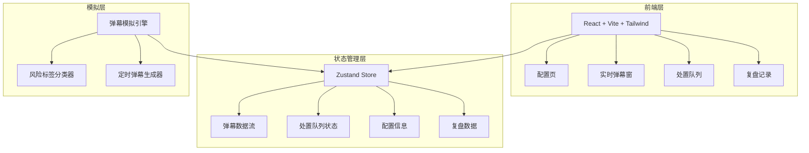
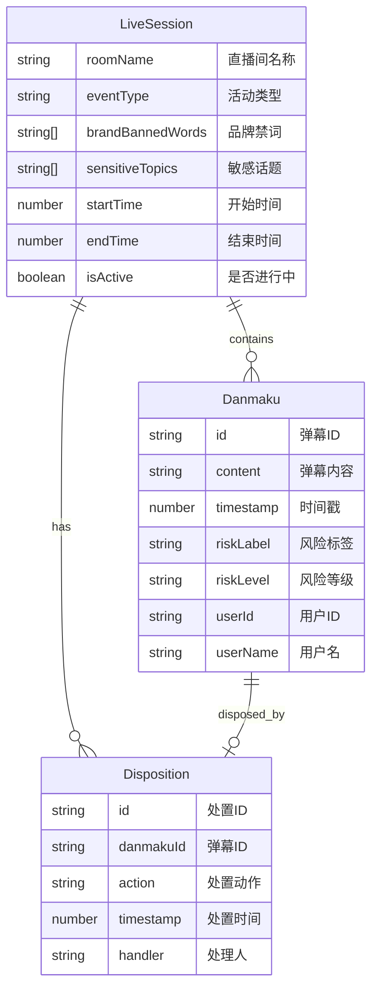

## 1. 架构设计



## 2. 技术说明

- **前端**：React@18 + TypeScript + Tailwind CSS@3 + Vite
- **初始化工具**：vite-init（react-ts 模板）
- **后端**：无（纯前端应用，使用模拟数据）
- **数据库**：无（使用 Zustand + localStorage 持久化）
- **图表库**：recharts（用于折线图、饼图）
- **图标库**：lucide-react

## 3. 路由定义

| 路由 | 用途 |
|------|------|
| `/` | 配置页——输入直播间信息和风险词库 |
| `/monitor` | 盯屏主界面——实时弹幕窗 + 处置队列 + 统计面板 |
| `/review` | 复盘记录——风险时间线 + 词云 + 统计 + 日志 |

## 4. API 定义

无后端 API，使用前端弹幕模拟引擎生成模拟弹幕数据。

### 4.1 弹幕模拟引擎接口

```typescript
interface Danmaku {
  id: string;
  content: string;
  timestamp: number;
  riskLabel: RiskLabel;
  riskLevel: RiskLevel;
  userId: string;
  userName: string;
}

type RiskLabel =
  | "辱骂"
  | "人身攻击"
  | "诱导维权"
  | "涉政擦边"
  | "恶意带节奏"
  | "正常";

type RiskLevel = "high" | "medium" | "low" | "none";

interface Disposition {
  id: string;
  danmakuId: string;
  action: DispositionAction;
  timestamp: number;
  handler: string;
  danmakuContent: string;
  riskLabel: RiskLabel;
}

type DispositionAction =
  | "提醒主播绕开"
  | "请求禁言"
  | "截图留证"
  | "暂不处理";

interface LiveSession {
  roomName: string;
  eventType: string;
  brandBannedWords: string[];
  sensitiveTopics: string[];
  startTime: number;
  endTime?: number;
  isActive: boolean;
}

interface ReviewData {
  riskTimeline: { minute: number; count: number }[];
  topRiskWords: { word: string; count: number }[];
  dispositionStats: {
    total: number;
    processed: number;
    unprocessed: number;
    byAction: Record<DispositionAction, number>;
  };
  dispositionLog: Disposition[];
}
```

## 5. 服务器架构图

不适用（纯前端应用）

## 6. 数据模型

### 6.1 数据模型定义



### 6.2 数据定义语言

不适用（使用 Zustand 内存状态 + localStorage 持久化，无关系型数据库）
